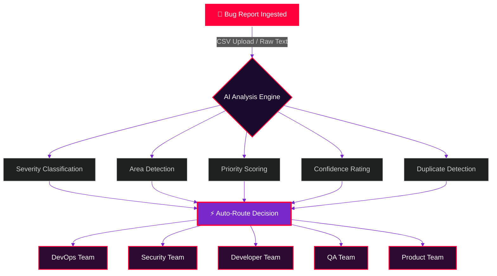

<p align="center">
  
</p>

<div align="center">
  
  [](https://git.io/typing-svg)

</div>

<p align="center">
  <a href="https://bug-triage-ai-alpha.vercel.app/" target="_blank">
    
  </a>
  
  
  
  
  
</p>

<p align="center">
  <a href="https://bug-triage-ai-alpha.vercel.app/" target="_blank">
    
  </a>
</p>

---

## 🌑 The Dark Architecture

<div align="center">


<br>
</div>
<br>

---

## ⚡ Core Capabilities

| Capability | Description | Status |
|---|---|---|
| 📁 **Smart Upload** | CSV upload or raw text paste for instant analysis | `ACTIVE` |
| 🎯 **AI Classification** | Severity, area, priority & confidence scoring | `ACTIVE` |
| 👥 **Auto-Assignment** | Recommends optimal team automatically | `ACTIVE` |
| 💬 **Chat Assistant** | Ask questions about current analysis | `ACTIVE` |
| 📊 **Export** | JSON/CSV workspace export | `ACTIVE` |
| 🎭 **Role Views** | Dedicated dashboards per stakeholder | `ACTIVE` |

---

## 🎭 Role-Based Command Centers

<div align="center">

| Role | Path | Purpose |
|:---:|:---|:---|
| 🧑‍💼 **Manager** | `/roles/manager` | Overview dashboards & team metrics |
| 💻 **Developer** | `/roles/developer` | Code-level bug details & fixes |
| 🧪 **QA** | `/roles/qa` | Test cases & reproduction steps |
| 🔒 **Security** | `/roles/security` | Vulnerability assessment |
| 🚀 **DevOps** | `/roles/devops` | Infrastructure & deployment issues |
| 📋 **Product** | `/roles/product` | User impact & prioritization |

</div>

---

## 🏗️ Zero-Database Architecture

> **No PostgreSQL. No MongoDB. No backend storage.**
> 
> Everything lives in your browser session. Zero config, zero cost, zero persistence concerns.

```mermaid
%%{init: {'theme': 'dark', 'themeVariables': { 'primaryColor': '#ff003c', 'primaryTextColor': '#fff', 'primaryBorderColor': '#ff003c', 'lineColor': '#7928ca', 'secondaryColor': '#1a0b2e', 'tertiaryColor': '#2d0a31'}}}%%
flowchart LR
    A[Bug Report] --> B[Browser Session]
    B --> C[AI Analysis]
    C --> D[Session Storage]
    D --> E[Role Dashboard]
    E --> F[Export JSON/CSV]
    
    style A fill:#ff003c,stroke:#fff,stroke-width:2px,color:#fff
    style B fill:#1a0b2e,stroke:#ff003c,stroke-width:2px,color:#fff
    style C fill:#7928ca,stroke:#ff003c,stroke-width:2px,color:#fff
    style D fill:#1a0b2e,stroke:#ff003c,stroke-width:2px,color:#fff
    style E fill:#2d0a31,stroke:#ff003c,stroke-width:2px,color:#fff
    style F fill:#ff003c,stroke:#fff,stroke-width:2px,color:#fff
```



---

## 🚀 Live Demo & Quick Start

### 🔥 Try It Live
**[https://bug-triage-ai-alpha.vercel.app/](https://bug-triage-ai-alpha.vercel.app/)**

### 🛠️ Local Development

```bash
# Clone the repository
git clone https://github.com/Nithisvaran-M/bug-triage-ai.git
cd bug-triage-ai

# Install dependencies
npm install

# Start development server
npm run dev
```

Then open [http://localhost:3000](http://localhost:3000) 🚀

---

## 🔑 Environment Variables

Create `.env.local` for optional AI provider keys:

```env
# AI Provider Keys (Optional - falls back to heuristic analyzer)
OPENAI_API_KEY=sk-...
ANTHROPIC_API_KEY=sk-ant-...
GROQ_API_KEY=gsk_...
```

> 💡 **Leave blank to use the built-in heuristic analyzer** — no API keys required!

---

## 🎬 Demo Highlights

Perfect for presentations & portfolio showcases:

| Feature | Description |
|---|---|
| 🏠 **Main Workspace** | Upload & analyze bugs in seconds |
| 🧑‍💼 **Manager View** | High-level metrics & team workload |
| 💻 **Developer View** | Technical deep-dives & stack traces |
| 🧪 **QA View** | Reproduction steps & test coverage |
| 🤖 **Chat Assistant** | Conversational analysis queries |
| 📥 **Export Data** | JSON/CSV workspace snapshots |

---

## 📜 License

This project is licensed under the **MIT License** — see the [LICENSE](LICENSE) file for details.

---

<p align="center">
  <a href="https://bug-triage-ai-alpha.vercel.app/" target="_blank">
    
  </a>
</p>

<p align="center">
  
</p>
```

